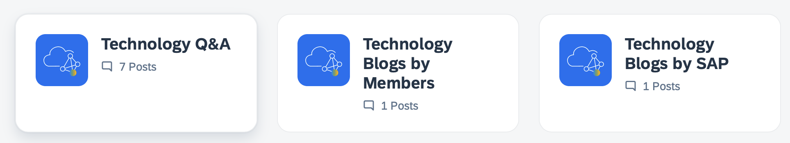
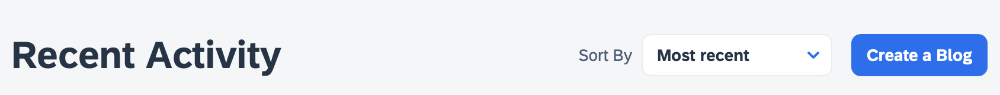
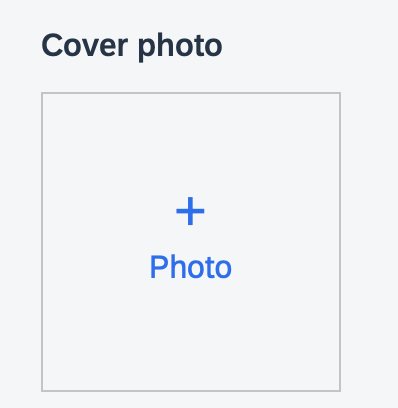
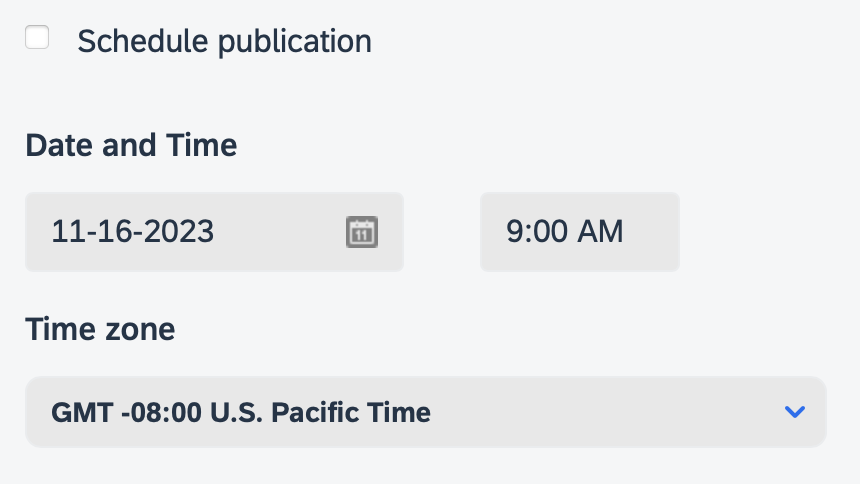

# Write and Publish Blog Posts in the SAP Community
<!-- description --> If you are here, you are interested in sharing your knowledge and experience with the SAP Community. By completing this tutorial, you'll unlock the permissions required to submit your first draft blog post to the new SAP Community platform. The purpose of the tutorial is to enable you to discover how to prepare and manage your blog posts on SAP Community, get tips for better blogging, and learn how to interact with readers. You will also learn about our blogging guidelines, expectations, and processes related to blogging within the platform.

 **Please note:** If you were previously a blogger within the SAP Community and you are not able to submit blog posts today, you should be able to resolve this issue by completing this tutorial. If not, please contact <a href="mailto:community@sap.com">community@sap.com</a>. 

## Prerequisites
- Log into the [SAP Community](https://community.sap.com) before starting the tutorial.
- If you do not already have an SAP user account and profile, [register for an account](https://accounts.sap.com/ui/public/showRegisterForm?spName=https%3A%2F%2Fhana.ondemand.com%2Fskywalker).
- Complete the [Tour the SAP Community 2024](community-2024) tutorial before beginning this one. The combination of the two will enable the permissions you need within the platform.

## You will learn
-	Engagement and blogging guidelines
-   How to use the blogging tool
-	How to tag your content
-	Best practices for writing content that connects with readers
-	About the rank ladder and earning permissions

---

### Guidelines make everything better!

The SAP Community is an inclusive environment that has multiple personas, roles, and types of users, so it is important to us that you are familar with our own blogging guidelines and Rules of Engagement. Blogging and community are not new topics, and each destination on the internet has its own variations. SAP Community is no different. Please be sure to review our terms before continuing: [Rules of Engagement](https://community.sap.com/resources/rules-of-engagement).

<!-- border -->

Additional points to keep in mind when starting your blogging journey. 

- Employees are subject to additional guidelines that can be found within our internal resources.
- A blog post is a snapshot in time; these are not meant to be continuously updated or modified over extended periods of time.
- A blog post is not a tutorial. A blog post can reference a tutorial but should not be the tutorial itself.
- In this case, a tutorial and "how to" are similar.

Please familiarize yourself with the Rules of Engagement, then answer the following.

### Get to know the blogging tool

To submit your blog post, you will first need to decide the appropriate spot within the community for your post. Is it a group? Or one of our product-related areas? (Note that the image below shows the navigation as it will appear after our January 2024 migration.)

<!-- border -->

For the purposes of this tutorial, we will assume you are selecting an area within the **Products and Technology** section for your blog post. Each area is set up in a similar manner. 

<!-- border -->

As an SAP employee, you should select the "Blogs by SAP" section. If you aren't an employee, you should select "Blogs by Members." Once you've made the appropriate selection, you should click **Create a Blog Post**, which then opens the blogging tool.

<!-- border -->

The primary elements of the blogging tool can easily be broken down into these three sections: "Title," "Teaser," and "Body"

The title should be something readable by the user and easily understood. Avoid clickbait titles as the SAP Community audience avoids those posts.

<!-- border -->

The "Teaser" is optional and can be skipped. If you choose to use it though, this can be something catchy or central to your post that you can add or copy and paste in to help readers decide if they would like to open your post.

<!-- border -->

And finally the "Body" is the heart of your post and contains the primary information.

<!-- border -->

If you need a bigger window to work in, you can click and drag the symbol in the bottom right corner to enlarge the area.

<!-- border -->

Please familiarize yourself with the tool and the advice above, then answer the following.

### Use tags

Once you decide where you will write, you'll need to select tags that match the topics that your blog post covers. Please read the **SAP Managed Tags** section of the [Help](https://groups.community.sap.com/t5/help/faqpage/title/Associated_Products) page to learn more.

<!-- border -->

You must enter at least one SAP Managed Tag, and you may use up to seven.

There are also article tags that allow you to further refine your content with additional meta information. These are free-form tags and should be used with consideration for the reader and how they would interpret the terms.

<!-- border -->

### Know your audience

SAP Community brings together people from all around the world and from all aspects of the SAP ecosystem, and by learning how to write relevant content for them, you'll draw a larger audience and increase readership for your blog post. 

When preparing a blog post, you should write in your voice -- so that you can establish yourself as an expert while growing your reputation and building your professional network. 

Reviewing our content, we have found that blog posts following a three-act structure -- with a clear introduction, body, and conclusion -- ensure the best readability. These posts perform better and draw more readers compared to posts without this structure. 

Finally, once you've published your blog post, you have the opportunity to promote it and interact with your audience. If your post does well, there is a chance that it may be featured within the site or social media. In those cases, a cover photo may be added if one does not exist. (If you add a cover photo yourself, please ensure that its dimensions are 600 x 420 pixels.)

<!-- border -->

### One last thing

As your progress in your journey and climb up the SAP Community "rank ladder," you will unlock additional permissions such as being able to publish directly and even scheduling your post for publication. (New bloggers may have their posts go through moderation, and curators/owners for certain groups may need to review posts prior to publication to decide whether the content is relevant for their areas.)

<!-- border -->

Thank you for taking our blogging tutorial! Stay tuned to receive your blogging permissions!

Happy blogging!
