# Tour the SAP Community

<!-- description --> Explore the various features, functionality, and aspects of the SAP Community, familiarize yourself with community guidelines, and discover how to get the most out of your membership.

## Prerequisites

- If you do not already have an SAP user account and profile, [register for an account](https://accounts.sap.com/ui/public/showRegisterForm?spName=https%3A%2F%2Fhana.ondemand.com%2Fskywalker).
- Go to [SAP Community](https://community.sap.com) and log in before starting the tutorial.

## You will learn

- About key settings in your SAP profile
- How to follow tags, content, and people
- About the Rules of Engagement
- How to ask and answer questions and write blog posts
- How to engage with groups, topics, and events

## Intro

This tutorial will be updated to reflect updates in the community.

SAP Community is SAP's destination for all things community. Our community hosts multiple areas for partners and customers, primarily providing public content accessible to visitors. Originally launched in 2003 as the SAP Developer Network (SDN), the site has progressed over the years and is now simply known as SAP Community, delivering a wealth of knowledge about all aspects of SAP technology, services, and products.

**Note:** If you wish to move up our [rank ladder](https://community.sap.com/t5/what-s-new/let-the-gamification-begin/ba-p/311892) so that you can [blog in SAP Community](https://community.sap.com/t5/what-s-new/what-you-need-to-know-about-blogging-post-migration/ba-p/309730), you must complete the actions outlined in this tutorial. You can't simply click "Done" for each step. You must follow the instructions in each step.

### Set your display name

In order to participate fully in the SAP Community, you’ll need to create a display name during the SAP Universal ID registration process.

Your display name is what all other members can see when you post comments, ask questions, or write blog posts. The name should be professional, unique, and appropriate. For example if your name is "Sally Smith," you could use "sallysmith," "sallys," "ssmith," or (perhaps you're lucky and no one has already claimed it) "sally."

1. Start the registration process via [SAP Universal ID Registration](https://account.sap.com/core/create/register).
2. Add your SAP Community display name in the “Username” field.

   <!-- border -->

   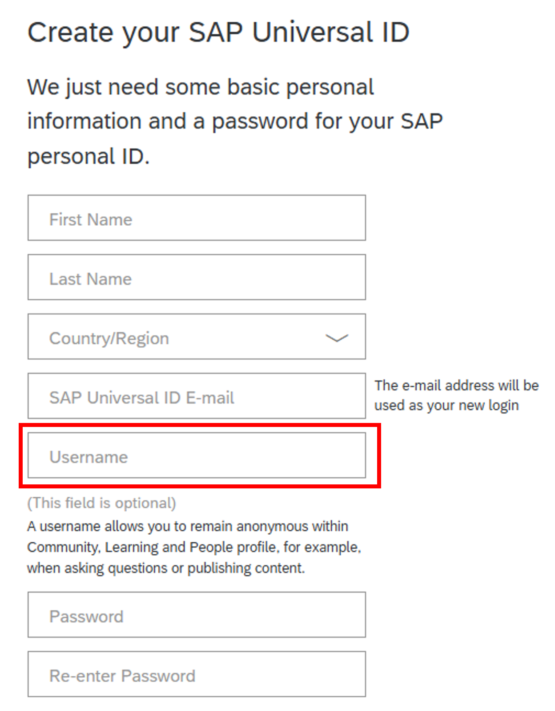

If you already have an SAP Universal ID, you can go directly to the SAP Universal ID account manager to add a username (if the field is blank) or change your username.

1. Sign in to SAP Universal ID account manager at [SAP Universal ID Sign In](https://account.sap.com/).
2. Select [Edit]

   <!-- border -->

   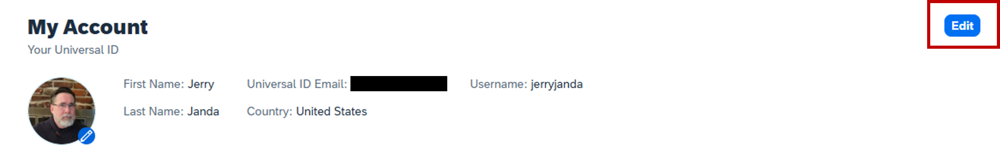

3. Enter or change the display name in the “Username” field, then click [Save].

   <!-- border -->

   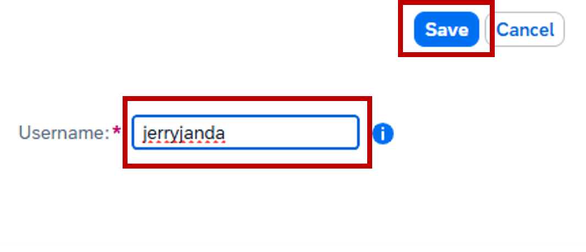

Please do not use your user ID, email address, your company name, the SAP name/brand, or a series of numbers or letters. However, we encourage SAP Community members to use their real names.

### Set your notification preferences

Notifications can let you know when something happens related to your published questions, blog posts, replies, comments, or around the topics you find interesting. The platform offers an extensive ability to fine-tune your notifications to meet your needs.

Go to [My settings](https://community.sap.com/t5/user/myprofilepage/tab/personal-profile) (accessible by clicking your avatar in the upper right and selecting `Settings`), select **Subscriptions & Notifications**, and choose which notifications you would like to receive.

<!-- border -->

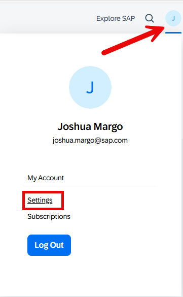

<!-- border -->

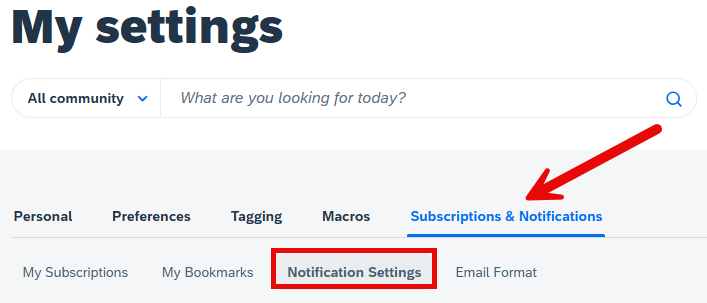

<!-- border -->

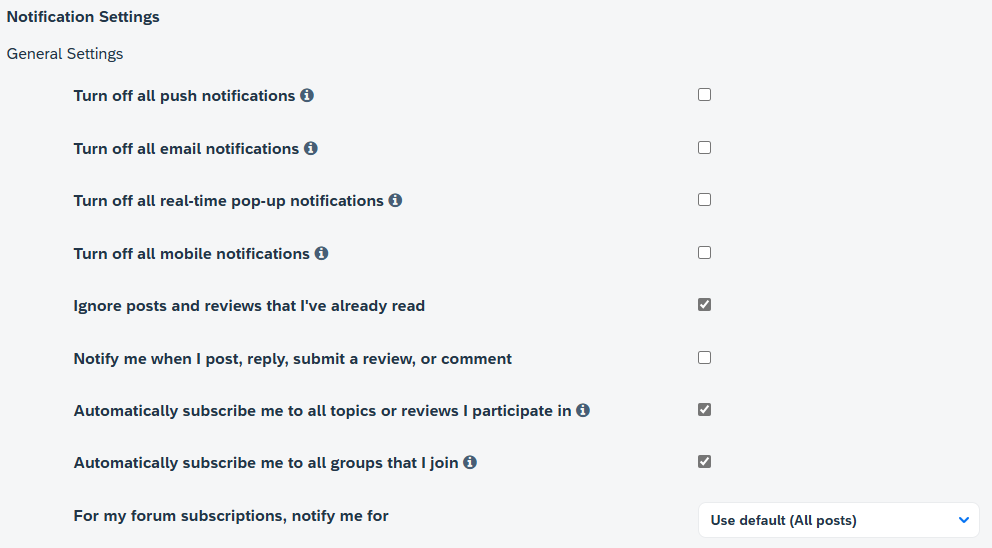

<!-- border -->

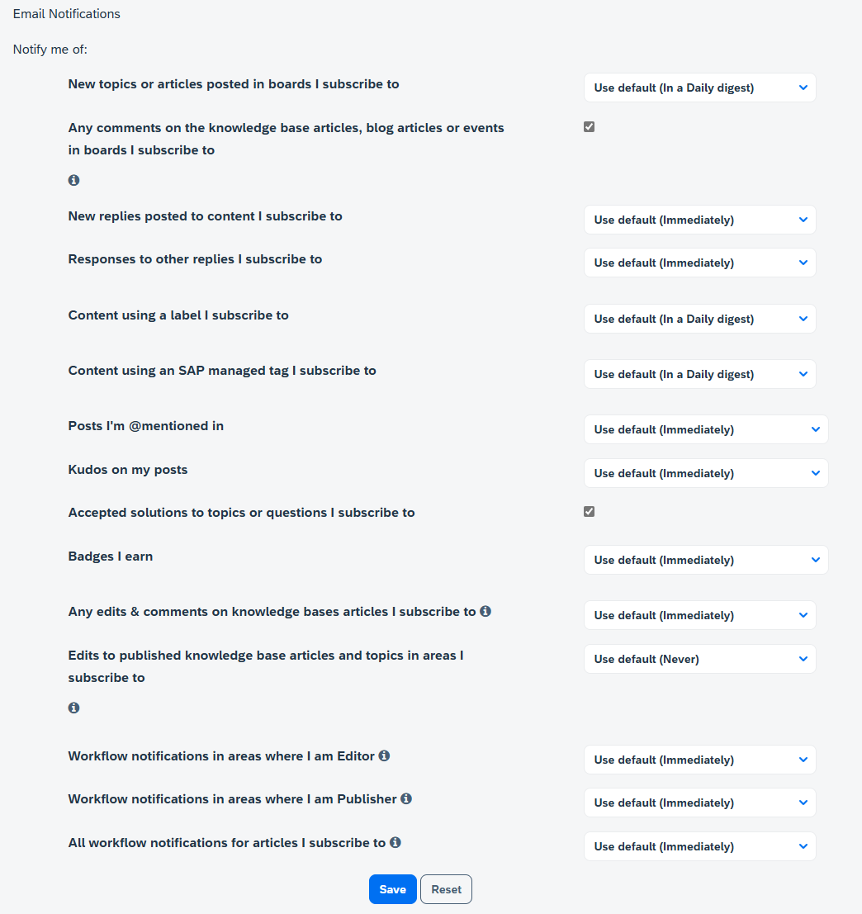

> While there, be sure to select your default time zone under the **Preferences** tab.

### Review the Rules of Engagement - Part 1

Understanding the [SAP Community Rules of Engagement](https://community.sap.com/resources/rules-of-engagement) will allow you to be active in the community without encountering issues or negative feedback when you post a question, answer, or blog post. For example, when you try to publish a blog post, if you have not read the Rules of Engagement, the publishing process may be postponed because the blog post does not follow the Rules of Engagement.

This step covers **Article 1: Participation Etiquette** of the Rules of Engagement.

1. Read the details in **Article 1: Participation Etiquette**.

2. Answer the following question:

### Review the Rules of Engagement - Part 2

Understanding the [SAP Community Rules of Engagement](https://community.sap.com/resources/rules-of-engagement) will allow you to be active in the community without encountering issues or negative feedback when you post a question, answer, or blog post. For example, when you try to publish a blog post, if you have not read the Rules of Engagement, the publishing process may be postponed because the blog post does not follow the Rules of Engagement.

This step covers **Article 4: Unacceptable Content** of the Rules of Engagement.

1. Read the details in **Article 4: Unacceptable Content**.

2. Answer the following question:

### Join a group and introduce yourself

A **Group** allows you to connect and conduct valuable conversations with people who share the same interests. Groups and their content focus on a single location, interest, industry, activity, program, and so on. They don't focus on specific products and partnerships, as these topics are covered elsewhere in SAP Community.

Groups can include discussions, Q&A, blog posts, and/or a knowledge base, depending on their purpose, and some may be private. Groups are categorized to make it easier to find the right group for you.

> Now that you have yourself sorted, you are ready to start taking full advantage of the platform. There are a couple of things we recommend to start with that will help you familiarize yourself with the platform and topics.

> If you wish to blog in SAP Community, you must take these actions. New members who don't join a group and participate as outlined below will be unable to blog on the site.

Your first step whenever you come some place new is to introduce yourself. We just so happen to have the perfect place for that: The [Welcome Corner](https://community.sap.com/t5/welcome-corner/gh-p/welcome-corner)!

<!-- border -->

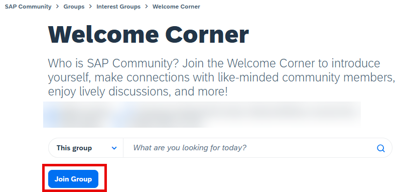

Once there you can choose to `Join Group`.

Now that you have "joined" the group, you are able to contribute to the conversations within that particular group, so why not take a [quick moment](https://community.sap.com/t5/welcome-corner-blog-posts/welcome-all-sap-community-members-start-here/ba-p/5359) to say hello. As previously noted, joining a group and saying hello will help you move up the rank ladder so you can participate in blogging.

We have a wide selection of groups to choose from. Feel free to explore and join others.

<!-- border -->

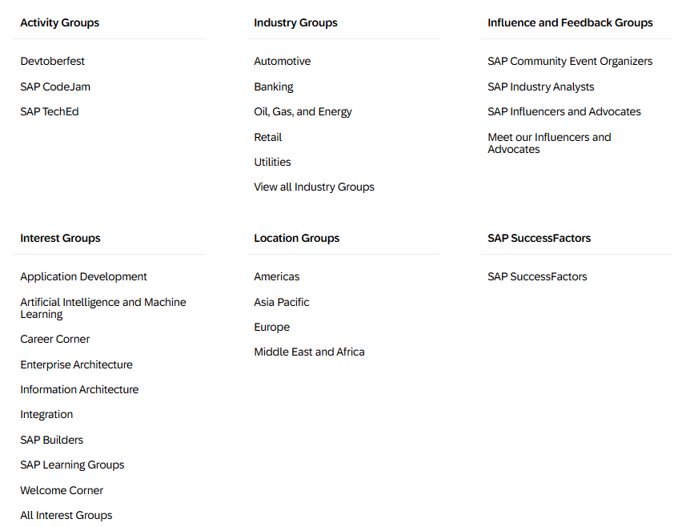

### Stay up to date

We have a dedicated space for new information related to the SAP Community, new groups being added, new features, functionalities, and so on. Your next quick step into the community is around your subscriptions.

Head over to the [What's New](https://community.sap.com/t5/what-s-new/bg-p/whats-new) area and there you will see **Options** on the right-hand side. Click that and select **Subscribe**.

<!-- border -->

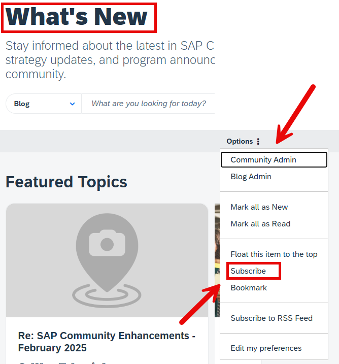

> The options available to you in the drop-down menu will vary depending upon your role in the community.

The SAP Community thrives when every member is active and engaged. Here are some other ways to stay up to date and get engaged:

1. **Attend** events (Don't forget to RSVP)
2. **Comment** on posts
3. **Participate** in discussions
4. **Answer** questions asked
5. **Like** (Kudos) and/or **Subscribe** to blog posts, discussions, and events.

<!-- border -->

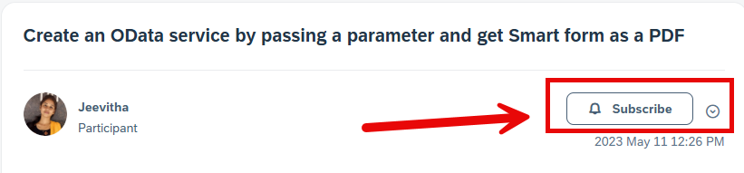

This will now keep you informed whenever we send out updates.

### Know when the next events are happening

We have a dedicated section allowing you to **subscribe** to [events](https://community.sap.com/t5/events/ct-p/events). You can RSVP, comment, and even watch livestreams.

<!-- border -->

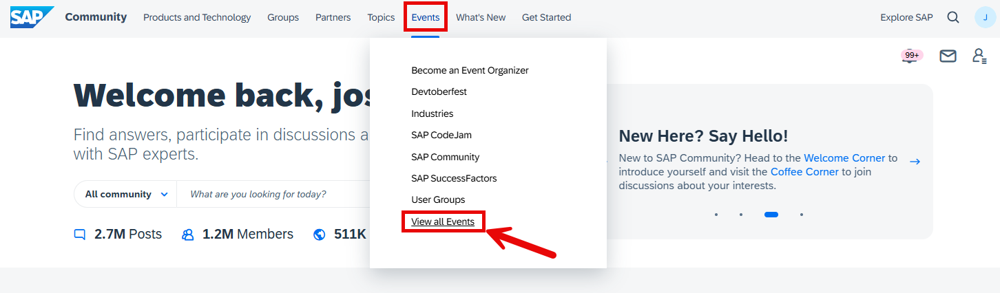

Here you can view things in either a list view or a calendar view, filter, subscribe, and more.

<!-- border -->

### Ask a question

With a wealth of knowledge already available, our Q&A areas can provide you with the answers you need. If you can't find an answer though, you can simply ask your question directly.

> Always try searching the community first before asking a question. There is a good chance it has already been asked and answered. Just enter the question or keywords in the search box on the SAP Community home page.

<!-- border -->

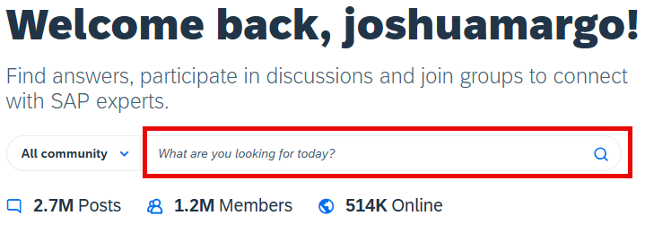

If you are unable to find the answer, navigate to the relevant **Product and Technology** category and select the tile for **Q&A**.

> If you need to create a new question, start with a descriptive title that outlines what your question is about. A clear question title will help community members gain a quick initial understanding of your question. It will also help community members find your question (and its answers) when they are searching for solutions to similar problems.
> When writing your question, please share what steps you took that led you to your question. Make sure that your question is **very specific**. Provide as many details as you can -- such as which product version you are using and what error message you're receiving. Include screenshots if possible. For more help on all things related to Q&A, please refer to the [Q&A section](https://community.sap.com/t5/help/faqpage/title/qa) or our FAQs.

<!-- border -->

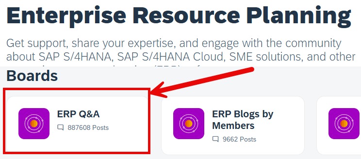

<!-- border -->

It is easy to answer a question. On any question, just select the `Answer` button. However, do not use this to submit a comment or clarifying question. For those, use the `Comment` button.

<!-- border -->

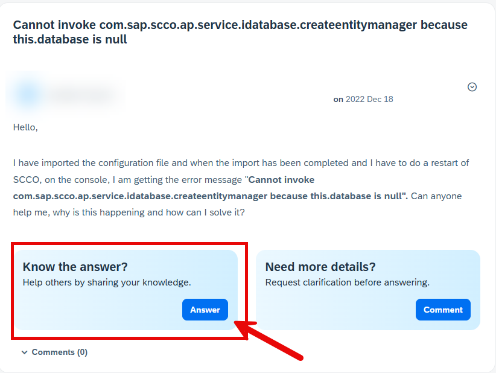

### Close the question loop by accepting a solution

> If you ask a question, please mark an answer as an accepted solution to your question. This gives weight to the answer and helps others identify a solution for their problem quicker. It also provides meaningful feedback and recognition to the person who took the time to provide an answer. Remember to thank them as well!

When community members answer one of your questions, you can choose the answer you think are the most useful, helpful, or accurate and mark them as a solution. While it is possible for `Product and Topic Experts`, `Active Contributors` and `Community Managers` to accept a solution, the best practice is for the question author to accept a solution because the author can test and verify the proposed solution.

To **accept** an answer to a question:

1. Go to the answer that you want to accept.
2. Click `Options > Accept as Solution`.

To **revoke** an accepted solution:

1. Go to the answer that you want to revoke.
2. Click `Options > Not the Solution`.

You can choose another solution or leave the question unsolved.

### Write and publish blog posts

Publishing blog posts in the SAP Community is a great way of sharing your own personal experience and knowledge.

You should always keep the following guidelines in mind when writing for the SAP Community audience:

- Apply the right structure: We expect every blog post to consist of a beginning (introduction), a middle (main portion), and an end (a conclusion that wraps everything up). A collection of links or just a video with short text **does not qualify as a blog post**.
- Write with the proper style, in your unique voice: We recommend a conversational writing style that is clear and easily understood. Ideally, a blog post **should reflect the author's unique voice**.
- If you want to publish content that was helped/created by GenAI, you must add the [user tag](https://community.sap.com/t5/help/faqpage/title/tagging) GenAI Assisted Content.

Additional points to keep in mind when starting your blogging journey.

- Employees are subject to additional guidelines that can be found within our internal resources.
- A blog post is a snapshot in time; these are not meant to be continuously updated or modified over extended periods of time.
- A blog post is not a tutorial. A blog post can reference a tutorial but should not be the tutorial itself.
- In this case, a tutorial and "how to" are similar.

Please familiarize yourself with the unacceptable content guidelines in the Rules of Engagement, Article IV, then answer the following.

### Get to know the blogging tool

To submit your blog post, you will first need to decide the appropriate spot within the community for your post. Is it a group? Or one of our product-related areas?

<!-- border -->

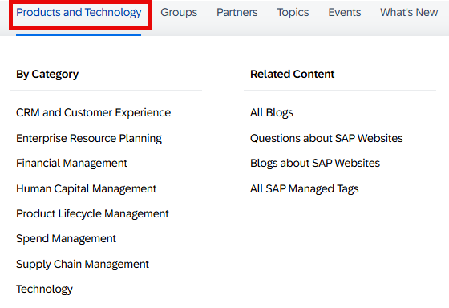

For the purposes of this tutorial, we will assume you are selecting an area within the **Products and Technology** section for your blog post. Each area is set up in a similar manner.

<!-- border -->

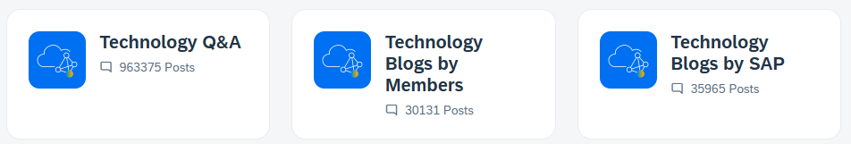

As an SAP employee, you should select the "Blogs by SAP" section. If you aren't an employee, you should select "Blogs by Members." Once you've made the appropriate selection, you should click **Create a Blog Post**, which then opens the blogging tool.

<!-- border -->

The primary elements of the blogging tool can easily be broken down into these three sections: "Title," "Teaser," and "Body"

The title should be something readable by the user and easily understood. Avoid clickbait titles as the SAP Community audience avoids those posts.

<!-- border -->

The "Teaser" is optional and can be skipped. If you choose to use it though, this can be something catchy or central to your post that you can add or copy and paste in to help readers decide if they would like to open your post.

<!-- border -->

And finally the "Body" is the heart of your post and contains the primary information.

<!-- border -->

If you need a bigger window to work in, you can click and drag the symbol in the bottom right corner to enlarge the area.

<!-- border -->

Please familiarize yourself with the tool and the advice above, then answer the following.

### Use tags

Once you decide where you will write, you'll need to select tags that match the topics that your blog post covers. Please read the **SAP Managed Tags** section of the [Help](https://community.sap.com/t5/help/faqpage/title/Associated_Products) page to learn more.

<!-- border -->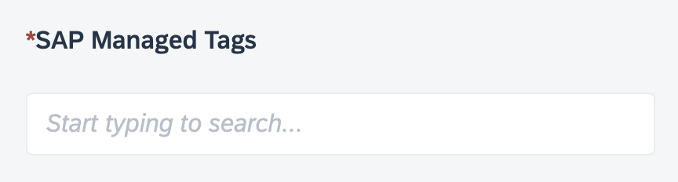

You must enter at least one SAP Managed Tag.

There are also article tags that allow you to further refine your content with additional meta information. These are free-form tags and should be used with consideration for the reader and how they would interpret the terms.

<!-- border -->

### Know your audience

SAP Community brings together people from all around the world and from all aspects of the SAP ecosystem, and by learning how to write relevant content for them, you'll draw a larger audience and increase readership for your blog post.

When preparing a blog post, you should write in your voice -- so that you can establish yourself as an expert while growing your reputation and building your professional network.

Reviewing our content, we have found that blog posts following a three-act structure -- with a clear introduction, body, and conclusion -- ensure the best readability. These posts perform better and draw more readers compared to posts without this structure.

Finally, once you've published your blog post, you have the opportunity to promote it and interact with your audience. If your post does well, there is a chance that it may be featured within the site or social media. In those cases, a cover photo may be added if one does not exist. (If you add a cover photo yourself, please ensure that its dimensions are 600 x 420 pixels.)

<!-- border -->

### One last thing about blogging

As your progress in your journey and climb up the SAP Community rank ladder, you will unlock additional permissions such as being able to publish directly and even scheduling your post for publication. But remember: If you're new and want to start blogging, you must take the actions outlined in this tutorial, particularly in Step 5.

Also please keep in mind that new bloggers may have their posts go through moderation, and curators/owners for certain groups may need to review posts prior to publication to decide whether the content is relevant for their areas.

If your post needs to go through moderation, please note that the moderation team may require up to **five business days** to conduct each review.

<!-- border -->

### Final thoughts about SAP Community

We believe that community is for everyone, and we welcome you to ours! We are here to help you on your learning journey! To learn even more about SAP Community, please read the FAQs in our [Help](https://community.sap.com/t5/help/faqpage) section and watch our [How-To Videos](https://pages.community.sap.com/resources/how-to-videos).
